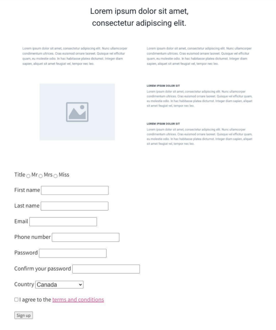

# Exercise 2.1 : (2 - 3 hours)

Create a new webpage on a subject that you're interested in. The page should **NOT** use anyframework like Bootstrap and it should include the following elements:

* The `.html` page and a linked `.css` file applies a consistent color scheme to links and text onyour page.
* A page header with a title and description for the site.
* An articles section with three articles, each including a title, summary and a link.
* A page footer containing info about you or the site.
* Proper use of the semantic HTML tags we discussed.
* Use this website [Lorem Ipsum](http://www.lipsum.com/) to generate random blocks of content to fill your website.
* Commit often (with good meaningful commit messages), and Push to Github regularly.
* Add a form to your site. This form can contain as many fields as you wish to have but makesure it follows proper use of the semantic HTML tags we discussed.  Add validation to thesefields without using any framework or JavaScript.
* On a larger device we should see a 2 column layout. On a smaller device the right sidecontent should stack below the image.  Add at least three more articles and then convert themto a grid, so that you show 3 articles per row in a box layout.
* Color the form button with any color of your choice. Using CSS, in :hover state changes thecolor. Again the color is of your choice.
* Use the sketch below to guide you towards the layout and content you are trying to achieve.
* Please note that this is just a sketch - you can choose the colors, fonts, images, input fields,validation messages etc. that you want to use in the page.

## Guidelines:  

1. There should be a separate branch created in GitHub for this exercise.
2. The UI is not subjected to look like the below. Please add your desired “look and feel” to thelayout and forms. Make sure Design looks good.
3. Semantic tags should be used for laying out the UI.
4. The Form validation is client-side validation. The validation messages could be subjective.
5. There should be one or more Git commits with meaningful commit messages.