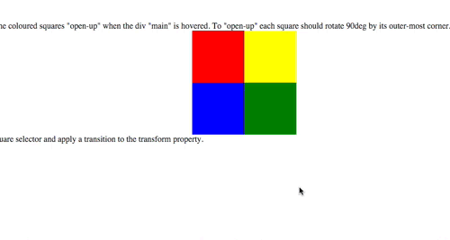

# Exercise 2.1 : (2 - 3 hours)

[Exercise 2.1 -  Google Docs](https://docs.google.com/document/d/1Cpz6QDkSOclhpBVXIzeyuK1t18FdfeStkOZgy_45MMA/edit)

## Exercise:- 
* Create a new `.html` page and link a `.css` file to it.
* Using CSS only, achieve the above animation.
* No frameworks or libraries to be used.
* **Commit often (with good meaningful commit messages), and Push to Github regularly.**

## Guidelines:
1. There should be a separate branch created in GitHub for this exercise.
2. The UI should closely match with the screengrab given as sample. Layout, forms, validationetc.
3. 3rd party CSS libraries should not have been used.
4. There should be one or more Git commits with meaningful commit messages