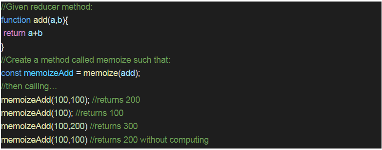

# Exercise 3.1:
### Create a memoize function that remembers previous inputs and stores them in cache so that it won’t have to compute the same inputs more than once. The function will take an unspecified number of integer inputs and a reducer method. **(1.5 hours)**

**Example:**  

  

## Guidelines:
1. The memozie function should be written from scratch.
2. 3rd party libraries such as loaddash or underscore should not have been used.
3. The function should carry a name which should denote the functionality of it.
4. The function should be able to take n number of arguments.

## Outcomes:
1. Understanding how caching works.
2. Why is it important?
3. The problem memoization solves.
