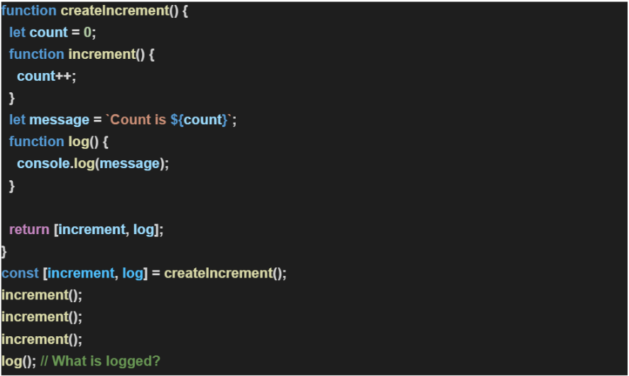

# Exercise 3.3:
### What is the output of the below problem and why: **(30 Min)**

## Guidelines:
1. The candidate should be able to explain the code with the desired output.
## Outcomes:
1. The candidates will understand how **'_closure_'** works in JS.
2. The candidates will understand how **'_encapsulation_'** works in JS.