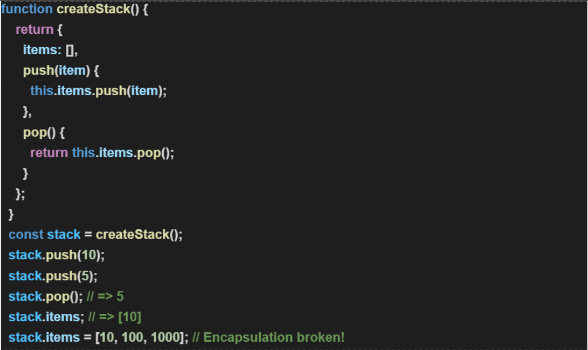
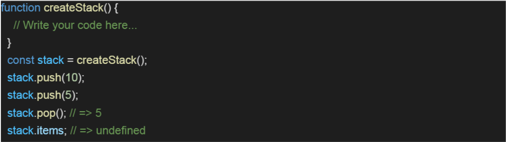

# Exercise 3.4:
### Refactor the above stack implementation, using the concept of closure, such that there is no way to access items array outside of createStack() function scope **(2 - 3 Hours)**  

  

## Guidelines:
1. The candidate should be able to refactor the code and get the desired output.
2. The candidate should be able to explaing the code why it was not working before.
3. The candidate should be able to explain the code why it is working now.  
   
## Outcomes:
1. The candidates will understand how **'_closure_'** works in JS.
2. The candidates will understand how **'_encapsulation_'** works in JS.  
   
# Explanation :

> By Moving items outside of the return statement, it is accessible to the **_`push`_**, **_`pop`_** & **_`status`_** but since it is not being returned in the statement. It cannot be accessed, **EXCEPT** through the returned methods.

> Hence, **Encapsulation** is not broken in this solution.