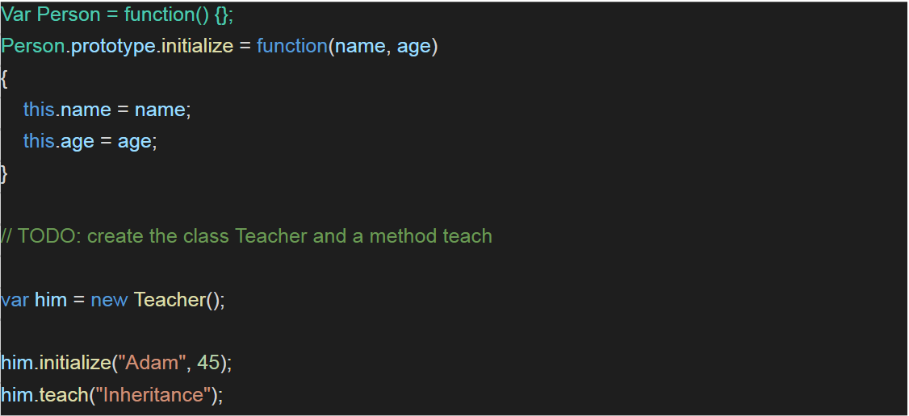

# Exercise 4.2:
### Create an object called **Teacher** derived from the **Person** class, and implement a method called **teach** which receives a string called **subject**, and prints out:

### **[`teacher's name`] is now teaching [`subject`]**

---
## Guidelines:
1. The expected output should be achieved using the keyword .prototype.
2. Reference:  

## Outcome:
1. The candidates will understand how inheritance works in JS.
2. The candidates will understand what a prototype keyword is in JS.
