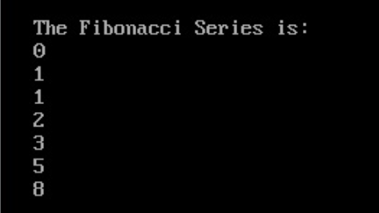

# Exercise 4.3:
### Implement Fibonacci Series with Iterators
### Sample output:

## Guidelines:
1. The expected output should be achieved using Iterators only.
2. Reference: https://medium.com/@akshayshekokar/fibonacci-series-with-iterators-90a8b3dd0d92
3. For Loops, Maps should not have been used.
4. 3rd party libraries should not have been used.

## Outcome:
1. Understanding how Iterators work.
2. Understanding ‘under the hood’ implementation of Iterators.
