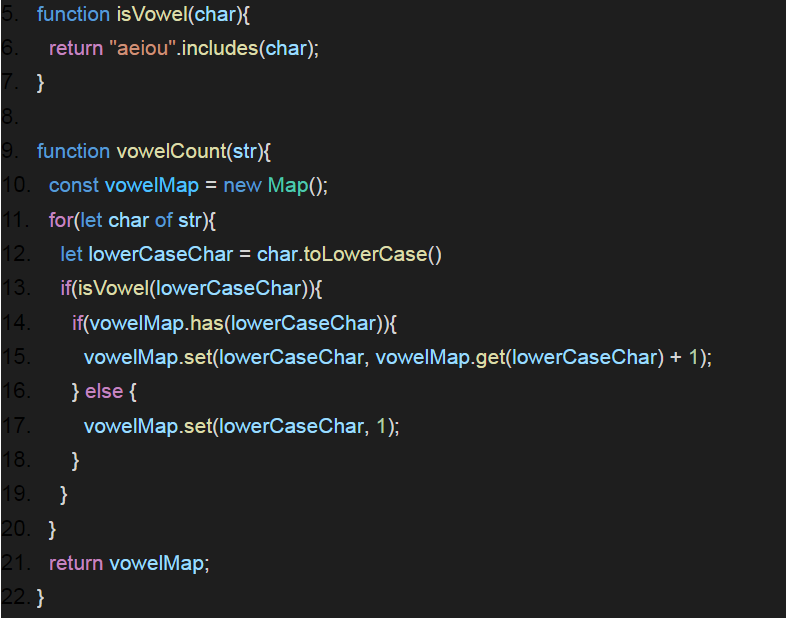

# Exercise 5.2:

### Write a function called vowelCount which accepts a string and returns a map where the keys are numbers and the values are the count of the vowels in the string.

## Guidelines:

1. JS function should have Map API implemented.
2. Map’s set functionality should have been used.
3. Bonus - if space and time complexity is taken care.
4. Reference:

## Outcomes:

1. Understanding of Map API and its functionalities.
