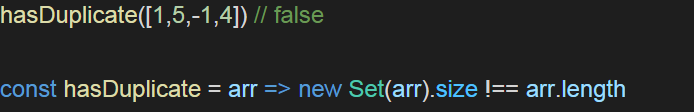

# Exercise 5.3:

### Write a function called hasDuplicate which accepts an array and returns true or false if that array contains a duplicate.

## Guidelines:

1. Reference:

   

2. JS function should have Set API implemented.
3. Bonus - if space and time complexity is taken care.

## Outcomes:

1. Understanding of Set API and its functionalities.
