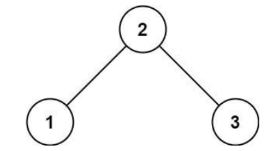
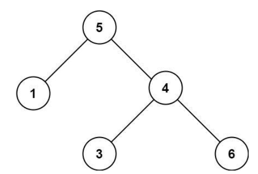

# Exercise 8.2:
### Validate a Binary Tree

Given the root of a binary tree, determine if it is a valid binary search tree (BST).  

A valid BST is defined as follows:  

The left subtree of a node contains only nodes with keys less than the node's key. Theright subtree of a node contains only nodes with keys greater than the node's key. Boththe left and right subtrees must also be binary search trees.

> Constraints:  
> * The number of nodes in the tree is in the range [0, 104].
> * 100 <= Node.val <= 100

Example 1:  
    Input:  
        root = [2,1,3]
          
Output: true  

Example 2:  
    Input:  
        root = [5,1,4,null,3,6]
          
Output: false  
Explanation: The root node's value is 5 but its right child;s value is 4.
